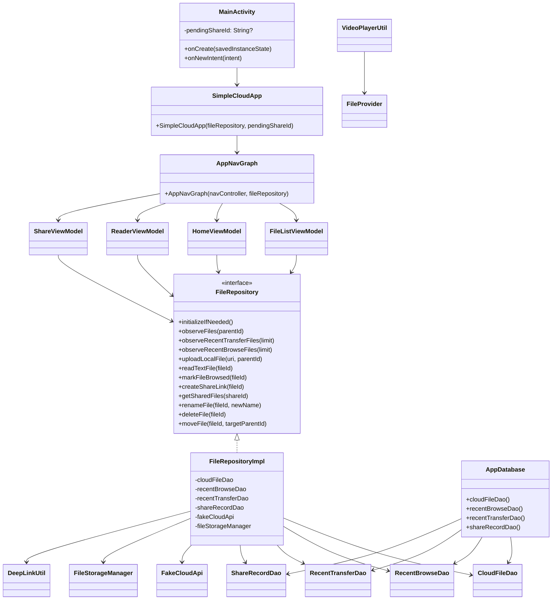
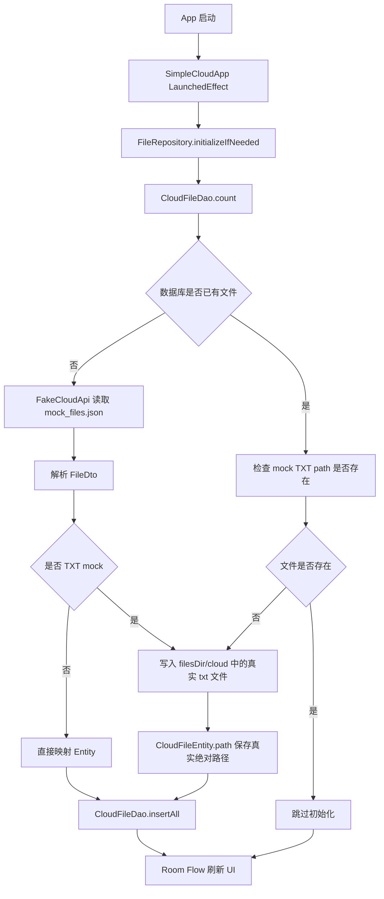
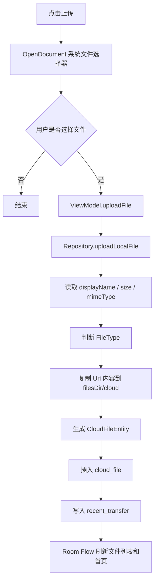
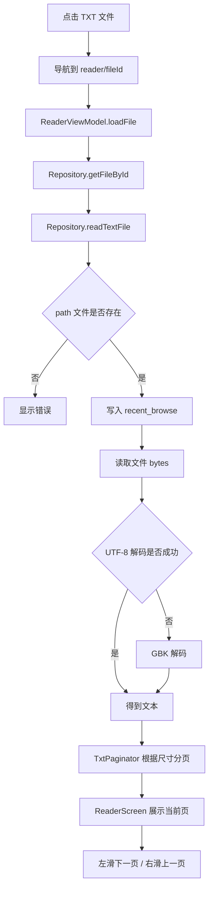
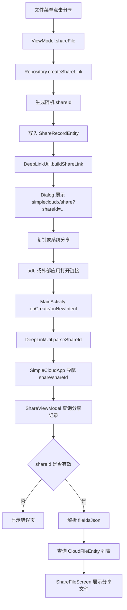

# 图表说明

## UML 类图

```mermaid
classDiagram
    class MainActivity {
        -pendingShareId: String?
        +onCreate(savedInstanceState)
        +onNewIntent(intent)
    }

    class SimpleCloudApp {
        +SimpleCloudApp(fileRepository, pendingShareId)
    }

    class AppNavGraph {
        +AppNavGraph(navController, fileRepository)
    }

    class FileRepository {
        <<interface>>
        +initializeIfNeeded()
        +observeFiles(parentId)
        +observeRecentTransferFiles(limit)
        +observeRecentBrowseFiles(limit)
        +uploadLocalFile(uri, parentId)
        +readTextFile(fileId)
        +markFileBrowsed(fileId)
        +createShareLink(fileId)
        +getSharedFiles(shareId)
        +renameFile(fileId, newName)
        +deleteFile(fileId)
        +moveFile(fileId, targetParentId)
    }

    class FileRepositoryImpl {
        -cloudFileDao
        -recentBrowseDao
        -recentTransferDao
        -shareRecordDao
        -fakeCloudApi
        -fileStorageManager
    }

    class AppDatabase {
        +cloudFileDao()
        +recentBrowseDao()
        +recentTransferDao()
        +shareRecordDao()
    }

    class CloudFileDao
    class RecentBrowseDao
    class RecentTransferDao
    class ShareRecordDao
    class FakeCloudApi
    class FileStorageManager
    class DeepLinkUtil
    class VideoPlayerUtil

    class FileListViewModel
    class HomeViewModel
    class ReaderViewModel
    class ShareViewModel

    MainActivity --> SimpleCloudApp
    SimpleCloudApp --> AppNavGraph
    AppNavGraph --> FileListViewModel
    AppNavGraph --> HomeViewModel
    AppNavGraph --> ReaderViewModel
    AppNavGraph --> ShareViewModel
    FileListViewModel --> FileRepository
    HomeViewModel --> FileRepository
    ReaderViewModel --> FileRepository
    ShareViewModel --> FileRepository
    FileRepository <|.. FileRepositoryImpl
    FileRepositoryImpl --> CloudFileDao
    FileRepositoryImpl --> RecentBrowseDao
    FileRepositoryImpl --> RecentTransferDao
    FileRepositoryImpl --> ShareRecordDao
    FileRepositoryImpl --> FakeCloudApi
    FileRepositoryImpl --> FileStorageManager
    FileRepositoryImpl --> DeepLinkUtil
    VideoPlayerUtil --> FileProvider
    AppDatabase --> CloudFileDao
    AppDatabase --> RecentBrowseDao
    AppDatabase --> RecentTransferDao
    AppDatabase --> ShareRecordDao
```

## 初始化数据流程图

```mermaid
flowchart TD
    A[App 启动] --> B[SimpleCloudApp LaunchedEffect]
    B --> C[FileRepository.initializeIfNeeded]
    C --> D[CloudFileDao.count]
    D --> E{数据库是否已有文件}
    E -- 否 --> F[FakeCloudApi 读取 mock_files.json]
    F --> G[解析 FileDto]
    G --> H{是否 TXT mock}
    H -- 是 --> I[写入 filesDir/cloud 中的真实 txt 文件]
    H -- 否 --> J[直接映射 Entity]
    I --> K[CloudFileEntity.path 保存真实绝对路径]
    J --> L[CloudFileDao.insertAll]
    K --> L
    E -- 是 --> M[检查 mock TXT path 是否存在]
    M --> N{文件是否存在}
    N -- 否 --> I
    N -- 是 --> O[跳过初始化]
    L --> P[Room Flow 刷新 UI]
    O --> P
```

## 上传流程图

```mermaid
flowchart TD
    A[点击上传] --> B[OpenDocument 系统文件选择器]
    B --> C{用户是否选择文件}
    C -- 否 --> Z[结束]
    C -- 是 --> D[ViewModel.uploadFile]
    D --> E[Repository.uploadLocalFile]
    E --> F[读取 displayName / size / mimeType]
    F --> G[判断 FileType]
    G --> H[复制 Uri 内容到 filesDir/cloud]
    H --> I[生成 CloudFileEntity]
    I --> J[插入 cloud_file]
    J --> K[写入 recent_transfer]
    K --> L[Room Flow 刷新文件列表和首页]
```

## TXT 阅读流程图

```mermaid
flowchart TD
    A[点击 TXT 文件] --> B[导航到 reader/fileId]
    B --> C[ReaderViewModel.loadFile]
    C --> D[Repository.getFileById]
    D --> E[Repository.readTextFile]
    E --> F{path 文件是否存在}
    F -- 否 --> G[显示错误]
    F -- 是 --> H[写入 recent_browse]
    H --> I[读取文件 bytes]
    I --> J{UTF-8 解码是否成功}
    J -- 是 --> K[得到文本]
    J -- 否 --> L[GBK 解码]
    L --> K
    K --> M[TxtPaginator 根据尺寸分页]
    M --> N[ReaderScreen 展示当前页]
    N --> O[左滑下一页 / 右滑上一页]
```

## DeepLink 分享流程图

```mermaid
flowchart TD
    A[文件菜单点击分享] --> B[ViewModel.shareFile]
    B --> C[Repository.createShareLink]
    C --> D[生成随机 shareId]
    D --> E[写入 ShareRecordEntity]
    E --> F[DeepLinkUtil.buildShareLink]
    F --> G[Dialog 展示 simplecloud://share?shareId=...]
    G --> H[复制或系统分享]
    H --> I[adb 或外部应用打开链接]
    I --> J[MainActivity onCreate/onNewIntent]
    J --> K[DeepLinkUtil.parseShareId]
    K --> L[SimpleCloudApp 导航 share/shareId]
    L --> M[ShareViewModel 查询分享记录]
    M --> N{shareId 是否有效}
    N -- 否 --> O[显示错误页]
    N -- 是 --> P[解析 fileIdsJson]
    P --> Q[查询 CloudFileEntity 列表]
    Q --> R[ShareFileScreen 展示分享文件]
```
